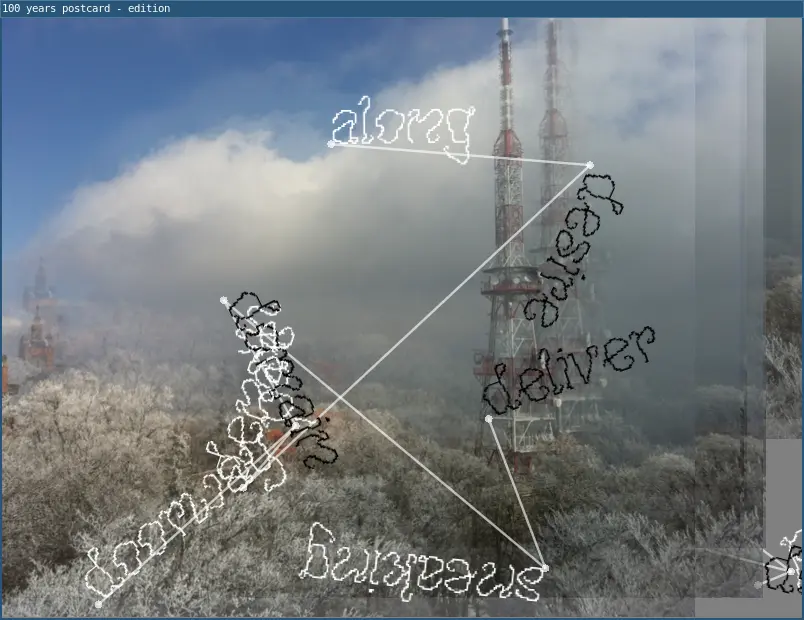

# Computational Poetry for 100 Years

by [Lee Tusman](https://leetusman.com) for Algorithmic Art Assembly 3.0  
26 March 2026

## Agenda

* Introductions
* What is permacomputing?
* What is L5?
* What is Computational Poetry?
* Examples
* Intro to L5 programming
* Jam
* Show-and-tell

## Resources

* [L5 website](https://l5lua.org) 
* [Permacomputing wiki](https://permacomputing.net)
* SF Permacomputing
* [Taper](https://taper.badquar.to)
* [Random Walk](https://randomwalk.club)

## Examples

### 100yrs

Demonstrates a basic example of "computational poetry" and procedural generation in L5.

### pennsyltucky

Demonstrates working with images and text.

### words-spin

A more fully-featured example.
